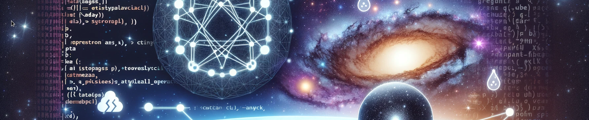

<!-- {"s_msg":"this file was automatically generated","s_by":"f_generate_markdown.module.js","s_ts_created":"Mon Mar 04 2024 01:13:57 GMT+0100 (Central European Standard Time)","n_ts_created":1709511237052} -->
# import es6 module ( in browser, deno (js), or node , if node finally supports es6 modules lol)
```javascript
import {
    f_a_o_job_info
     f_a_o_job_result
     f_o_platesolving_result
     f_o_session
     f_o_submission
     f_o_submission_info
} from "./module.js"
// use the web url !
//"https://deno.land/x/nova_astrometry_net_jsapi@[version_or_leave_blank]/mod.js"

```

# nova.astronomy.net js api , easy communication with the http API
## f_o_platesolving_result
mostly a all-in-one function
this is the function that does it all...
will repeatitly fetch the job info until the job is not 'solving' anymore / has finished
```javascript
            let n_ms_interval_fetch = 1000; // fetch all seconds to check if the job has started or finished
            let n_tries = 100; // try 100 times , if the job has not started or finished after 100 times the function will return null
            let o = await f_o_platesolving_result(
                s_api_key_real,
                {
                    // session: will automatically be inserted here
                    url: `https://i.ibb.co/VMhmXBV/m33-green.png`,//: string, required. The URL you want to submit to be solved
                    allow_commercial_use: "n",//: string: “d” (default), “y”, “n”: lic9ensing terms
                    allow_modifications: "n",//: string: “d” (default), “y”, “n”, “sa” (share-alike): licensing terms
                    publicly_visible: 'n',//: string: “y”, “n”
                    radius:  1,
                    //note, all parameters from the api documentation (https://astrometry.net/doc/net/api.html) can be used here
                    // session: string, requried. Your session key, required in all requests
                    // url: string, required. The URL you want to submit to be solved
                    // allow_commercial_use: string: “d” (default), “y”, “n”: licensing terms
                    // allow_modifications: string: “d” (default), “y”, “n”, “sa” (share-alike): licensing terms
                    // publicly_visible: string: “y”, “n”
                    // scale_units: string: “degwidth” (default), “arcminwidth”, “arcsecperpix”. The units for the “scale_lower” and “scale_upper” arguments; becomes the “–scale-units” argument to “solve-field” on the server side.
                    // scale_type: string, “ul” (default) or “ev”. Set “ul” if you are going to provide “scale_lower” and “scale_upper” arguments, or “ev” if you are going to provide “scale_est” (estimate) and “scale_err” (error percentage) arguments.
                    // scale_lower: float. The lower-bound of the scale of the image.
                    // scale_upper: float. The upper-bound of the scale of the image.
                    // scale_est: float. The estimated scale of the image.
                    // scale_err: float, 0 to 100. The error (percentage) on the estimated scale of the image.
                    // center_ra: float, 0 to 360, in degrees. The position of the center of the image.
                    // center_dec: float, -90 to 90, in degrees. The position of the center of the image.
                    // radius: float, in degrees. Used with center_ra,``center_dec`` to specify that you know roughly where your image is on the sky.
                    // downsample_factor: float, >1. Downsample (bin) your image by this factor before performing source detection. This often helps with saturated images, noisy images, and large images. 2 and 4 are commonly-useful values.
                    // tweak_order: int. Polynomial degree (order) for distortion correction. Default is 2. Higher orders may produce totally bogus results (high-order polynomials are strange beasts).
                    // use_sextractor: boolean. Use the SourceExtractor program to detect stars, not our built-in program.
                    // crpix_center: boolean. Set the WCS reference position to be the center pixel in the image? By default the center is the center of the quadrangle of stars used to identify the image.
                    // parity: int, 0, 1 or 2. Default 2 means “try both”. 0 means that the sign of the determinant of the WCS CD matrix is positive, 1 means negative. The short answer is, “try both and see which one works” if you are interested in using this option. It results in searching half as many matches so can be helpful speed-wise.
                    // image_width: int, only necessary if you are submitting an “x,y list” of source positions.
                    // image_height: int, ditto.
                    // positional_error: float, expected error on the positions of stars in your image. Default is 1.
                },
                1000,
                100, 
                (o_submission_info, a_o_job_info, n_try)=>{
                    console.log(`this is try ${n_try} of 100`)
                    console.log('the job has not yet started or at least one job is still in state "solving"...')
                    console.log(`trying again in 10 seconds...`)
                    console.log(
                        {
                            o_submission_info, 
                            a_o_job_info
                        }
                    )
                }
            )
            console.log(o) 
            // {
            //     o_submission: { status: "success", subid: 9346542 },
            //     a_o_job_result: [
            //       {
            //         n_id_job: 10070122,
            //         objects_in_field: [
            //           "M 33",
            //           "NGC 595",
            //           "NGC 598",
            //           "NGC 604",
            //           "Triangulum Galaxy",
            //           "Triangulum Pinwheel"
            //         ],
            //         machine_tags: [
            //           "NGC 595",
            //           "NGC 598",
            //           "Triangulum Galaxy",
            //           "Triangulum Pinwheel",
            //           "M 33",
            //           "NGC 604"
            //         ],
            //         tags: [
            //           "NGC 595",
            //           "NGC 598",
            //           "Triangulum Galaxy",
            //           "Triangulum Pinwheel",
            //           "M 33",
            //           "NGC 604"
            //         ],
            //         status: "success",
            //         original_filename: "m33-green.png",
            //         calibration: {
            //           ra: 23.419675319396895,
            //           dec: 30.636286522313913,
            //           radius: 0.6998978544097458,
            //           pixscale: 5.5676533386492695,
            //           orientation: 2.1464014425047253,
            //           parity: 1
            //         }
            //       }
            //     ]
            //   }
            // ...
```
## API Process
there are individual parts of the platesolving process when communicating with the api
for all of them there is a function
### process
the process looks like this
1. login
2. send submission
3. wait for job to start
4. wait for job to finish
## f_o_session
to manually login / get a session key you can use this function
```javascript
            let s_api_key = 'dkdjsodkwjfjdksa'
            let o_session = await f_o_session(s_api_key)
            console.log(o_session)
            // {
            //     status: "success",
            //     message: "authenticated user: some-user@some-email.com",
            //     session: "0gpt4pex7wv1p8w31vrl33t39jznddn1"
            // }
```
an invalid key will give this response
```javascript
            let o_session = await f_o_session('invalid_key')
            console.log(o_session)
            // { 
            //    status: "error",
            //    errormessage: "bad apikey"
            //}
```
## f_o_submission_info
returns information about the submission
```javascript
            let o = await f_o_submission_info(
                s_api_key_real,
                9345939
            )
            console.log(o) 
            // {
            //     n_subid: 3245939,
            //     user: 36652,
            //     processing_started: "2024-03-03 22:43:56.671203", // can be 'none'
            //     processing_finished: "2024-03-03 22:43:57.757034", // can be 'none'
            //     user_images: [ 3496597 ],
            //     images: [ 22141314 ],
            //     jobs: [ 10169521 ], //can be empty or [null]
            //     job_calibrations: []
            //  }
```
## f_a_o_job_info
returns information about the job / running solving process
```javascript
            let o = await f_a_o_job_info(
                s_api_key_real,
                9345929
            )
            console.log(o) 
            // [
            //     {
            //         n_id_job: 10029679,
            //         objects_in_field: [],
            //         machine_tags: [],
            //         tags: [],
            //         status: "solving", // can later be 'success' or 'failure'
            //         original_filename: "file-name-of-image.jpg"
            //     }
            // ]
              
```
## f_a_o_job_result
will repeatitly fetch the job info until the job is not 'solving' anymore / has finished
```javascript
            let o = await f_a_o_job_result(
                s_api_key_real,
                9345939, 
                10000,
                100, 
                (o_submission_info, a_o_job_info, n_try)=>{
                    console.log(`this is try ${n_try} of 100`)
                    console.log('the job has not yet started or at least one job is still in state "solving"...')
                    console.log(`trying again in 10 seconds...`)
                    console.log(
                        {
                            o_submission_info, 
                            a_o_job_info
                        }
                    )
                }
            )
            console.log(o) 
            // [
            //     {
            //         n_id_job: 10069679,
            //         objects_in_field: [],
            //         machine_tags: [],
            //         tags: [],
            //         status: "failure",
            //         original_filename: "file-name-of-image.jpg"
            //     }
            // ]
```